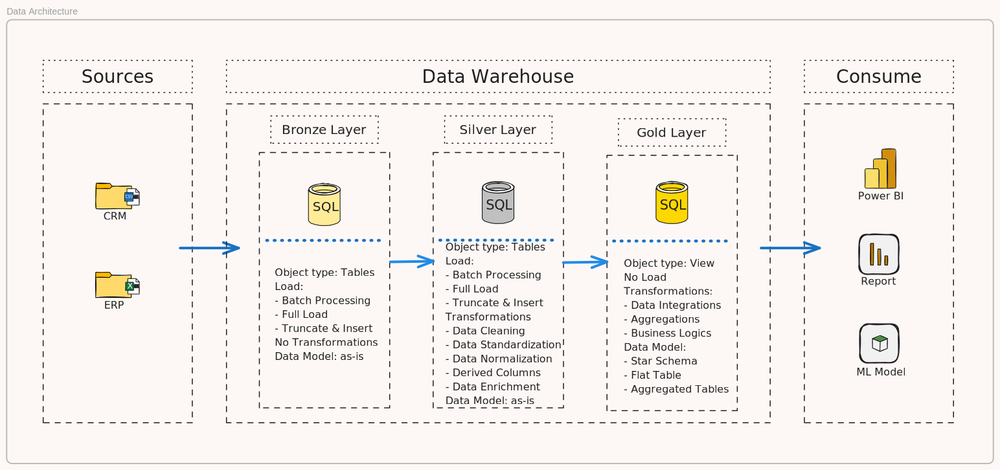

## SQL Data Warehouse from Scratch  
**SQL Data Warehouse from Scratch | Full Hands-On Data Engineering Project**

- Youtube Tutorial - [Link](https://www.youtube.com/watch?v=9GVqKuTVANE)
- Notion for Project Management - [Link](https://chlorinated-tortoise-8d2.notion.site/SQL-Data-Engineering-Project-19930acec9ca80e99c8fe4be5e1f1dc8?pvs=4)

### Requirement Analysis
#### Objective
Develop a modern data warehouse using SQL Server to consolidate sales data, enabling analytics and reporting.

#### Specifications
- Data Source: [CSV files](datasets/) (ERP and CRM) 
- Data Quality: Data Cleaning and Transformation prior to consuming
- Integration: To consolidate both sources into single data model
- Scope: Focus on latest dataset, and ignore historical data
- Documentation: Git Repository with README.md and SQL Scripts

#### Tools
- SQL Server
- Notion
- Github
- Excalidraw
- Dbeaver
  
### Design Data Architecture
- Data Warehouse -> Medallion Architecture



### Project Initialization
- Naming Conventions - using snake_case (lowercase with underscores between words)
- Language - English, and avoid using SQL reserved words

 #### Table Naming Conventions
 **Bronze & Silver Layer Rules**
 - All names must start with source system name and original table names (no renaming of tables)
 - ```<source_system>_<table_name>```
 - Example: ```erp_sales```, ```crm_customers```

**Gold Layer Rules**
- All names must be meaningful, business-aligned names for tables, starting with the category prefix:
  
 | Category | Description | Example |
 | ------- | ----------- | -------- |
 | dim_ | Dimension table | dim_customers |
 | fact_ | Fact table | fact_sales |
 | agg_ | Aggregated table | agg_sales_monthly |

**Surrogate Keys**
- All primary keys in dimension tables must use suffix ```_key```
- Example: ```customer_key``` in ```dim_customers``` table

**Technical Columns**
- All technical columns must use prefix ```dwh_``` followed by descriptive meaning
- ```dwh_<column_name>``` - exclusive for system-generated metadata
- Example: ```dwh_load_at``` -> System-generated column used to store the date when the record was loaded

**Stored Procedure**
- All stored procedures must use prefix ```load_<layer>```
- Example: ```load_bronze``` -> Stored procedure to load data into bronze layer